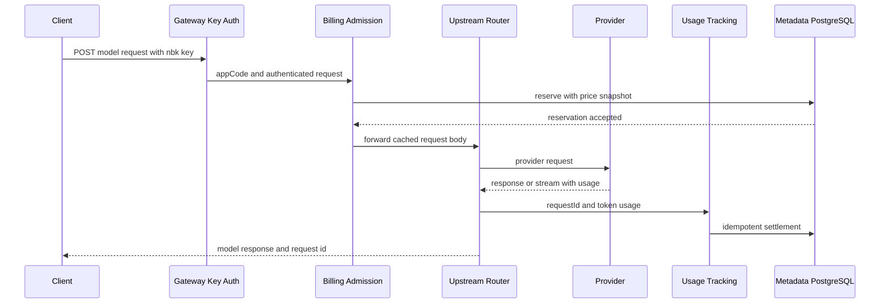

# AI Gateway 中央计费实现与开发审核记录

**日期：** 2026-07-22
**状态：** 实现完成、默认关闭；完成本文上线门禁后再灰度启用
**范围：** Nubase Java 数据面、metadata PostgreSQL、平台管理接口、项目只读接口
**技术栈：** Java 17、Spring Boot 3.2、Spring JDBC、PostgreSQL、Flyway、JUnit 5、Testcontainers

## 1. 直接结论

本次开发在现有 Nubase AI Gateway 上增加了一套中央强一致计费内核，已打通以下完整链路：

1. 用户继续通过项目创建出的 `nbk_` Gateway Key 调用现有 OpenAI/Anthropic 兼容接口。
2. 请求通过 Gateway Key 鉴权并解析出 `appCode` 后，计费过滤器生成唯一 `request_id`。
3. 系统按项目账户、模型价格快照、预估输入 Token 和最大输出 Token 原子预占金额。
4. 只有预占成功的请求才会进入现有上游路由和故障转移逻辑。
5. 上游返回 usage 后，系统按请求内价格快照进行幂等结算；租户 usage 表不参与余额计算。
6. usage 缺失、转发异常或超时的请求保留预占并进入 `RECONCILE_REQUIRED`，避免静默漏扣或错误退款。
7. 平台超级管理员可维护项目账户、充值/调账、模型售价、账单请求和中央账本；项目 service role 只能查询自己的账户、请求和账本。

计费能力通过 `nubase.ai-gateway.billing.enabled` 控制，默认值为 `false`。在价格、账户、余额和上游密钥完成准备前，不会改变线上请求准入行为；关闭状态下仍会统一生成 `x-nubase-request-id`，便于提前验证链路。

## 2. 实施状态

- [x] 中央账务数据库结构
- [x] 金额计算、价格快照和账务存储
- [x] 请求预占、幂等结算、人工释放和待对账状态
- [x] OpenAI/Anthropic/Responses 统一 request ID
- [x] 平台管理 API、项目只读 API 和模型发现
- [x] 账本查询与分页
- [x] 单元测试、应用全量测试、并发集成测试代码
- [x] 明文密钥扫描和 SQL 参数化检查
- [x] 上线顺序、模型数据清洗和审核说明

## 3. 架构边界

### 3.1 事实源

| 数据 | 权威事实源 | 说明 |
| --- | --- | --- |
| 项目身份 | 现有 Gateway Key 与 `MultiTenancyContext.appCode` | 不新增第二套项目鉴权 |
| 项目余额 | `public.ai_gateway_billing_accounts` | 余额、信用额度、活动预占 |
| 模型售价 | `public.ai_gateway_model_price_versions` | 平台售卖价格，不是上游成本 |
| 请求账单 | `public.ai_gateway_billing_requests` | 一个可计费请求一个状态机 |
| 财务流水 | `public.ai_gateway_billing_ledger` | balance/reserved delta 的 append-only 审计记录 |
| Token usage | 现有 OpenAI/Claude usage 解析结果 | 作为结算输入，不直接修改余额 |
| 运营统计 | 租户 usage 表和 `public.ai_gateway_usage_logs` | 仍是报表投影，不是财务事实源 |

所有财务表都放在 metadata PostgreSQL 的 `public` schema。预占和结算只跨同一个数据库内的账户、请求、流水三类数据，因此可以用短事务保证一致性，不依赖租户库分布式事务。

### 3.2 请求时序



过滤器在 Spring Security 中位于 `GatewayApiKeyAuthFilter` 和 `UnifiedMultiTenancyFilter` 之后。应用启动日志确认实际顺序为 Gateway Key 鉴权、租户上下文、计费准入，所以计费不会接受未认证客户端自行声明的 `appCode`。

## 4. 数据库契约

迁移文件：

- `src/main/resources/db/migration/V10__ai_gateway_billing.sql`：创建中央计费表、约束和索引。
- `src/main/resources/db/migration/V11__localize_ai_gateway_billing_comments.sql`：将四张计费表及全部字段的数据库注释统一为中文。

### 4.1 `ai_gateway_billing_accounts`

核心字段：

- `app_code`：项目唯一键。
- `balance`：已充值或调账后的可扣余额。
- `reserved_amount`：正在执行、尚未结算的预占总额。
- `credit_limit`：允许透支的信用额度。
- `status`：`ACTIVE`、`SUSPENDED` 或 `CLOSED`。
- `version`：每次余额或预占变化递增，便于审计与后续乐观锁扩展。

可用金额定义：

```text
available_amount = balance + credit_limit - reserved_amount
```

### 4.2 `ai_gateway_model_price_versions`

每个模型价格包含 input、output、cache creation、cache read 四种每百万 Token 单价。发布新价格时旧版本会被关闭，新请求使用新版本；已预占请求始终使用自身保存的价格快照，不受后续改价影响。

当前第一版只支持立即生效或回填当前价格，不支持预约未来生效，避免在同一模型上同时维护多个“未来当前版本”的复杂状态。

### 4.3 `ai_gateway_billing_requests`

状态机：

```text
RESERVED -> SETTLED
RESERVED -> RELEASED
RESERVED -> RECONCILE_REQUIRED -> SETTLED
RECONCILE_REQUIRED -> RELEASED
```

- `request_id` 是主键，同时贯穿网关日志和 usage 记录。
- `client_idempotency_key` 以 `(app_code, key)` 唯一，防止客户端重试重复预占。
- 价格字段全部在请求内快照化。
- `reserved_amount` 与 `actual_amount` 分开保存。
- usage 缺失时不能按零费用结算，只能进入待对账。

### 4.4 `ai_gateway_billing_ledger`

流水类型包括 `RESERVE`、`SETTLE`、`RELEASE`、`TOP_UP`、`ADJUSTMENT` 和 `REFUND`。每条流水保存：

- 本次 `balance_delta` 和 `reserved_delta`；
- 变更后的 `balance_after` 和 `reserved_after`；
- request ID、操作人、原因和币种；
- 全局唯一 `idempotency_key`。

应用代码不提供更新或删除流水的接口。生产数据库角色仍应按最小权限原则禁止业务账号直接修改历史流水。

## 5. 金额计算与并发保证

### 5.1 预占

预占输入价格使用普通 input 与 cache creation 中较高者，然后加上最大输出成本，并乘安全系数：

```text
reserved = ceil8((
  estimated_input_tokens * max(input_price, cache_creation_price) / 1_000_000
  + maximum_output_tokens * output_price / 1_000_000
) * safety_multiplier)
```

默认安全系数为 `1.10`。金额统一使用 `NUMERIC(24,8)` 和 `BigDecimal`，没有使用浮点数。

预占账户使用单条带余额条件的原子 `UPDATE`：

```sql
UPDATE public.ai_gateway_billing_accounts
SET reserved_amount = reserved_amount + :amount
WHERE id = :account_id
  AND status = 'ACTIVE'
  AND balance + credit_limit - reserved_amount >= :amount;
```

并发请求不能同时消费同一份可用余额。请求行、账户增量和 `RESERVE` 流水处于同一短事务中；任一步失败都会整体回滚。

### 5.2 结算

实际费用分别计算 input、output、cache creation 和 cache read，再以八位小数四舍五入。结算事务会锁定单个 billing request，释放全部预占并扣除实际金额。

如果实际金额高于预占金额，系统仍按真实 usage 扣款，并在超出余额和信用额度时将活动账户置为 `SUSPENDED`。这样不会因为估算偏低而漏扣，后续请求也不会继续进入上游。

重复 usage 回调看到 `SETTLED` 后直接返回第一次结算结果，不重复写流水、不重复扣款。

### 5.3 异常与对账

- 成功响应但 usage 为零：`RECONCILE_REQUIRED`。
- 上游错误且 usage 为零：`RECONCILE_REQUIRED`，因为同一 request ID 后续可能由故障转移成功。
- 预占后下游抛异常：`RECONCILE_REQUIRED`。
- `RESERVED` 超过默认 30 分钟：定时任务标记为 `RECONCILE_REQUIRED`。
- 只有平台超级管理员可以人工释放；释放原因写入 ledger，request 的短错误码固定为 `manually_released`。

## 6. 覆盖的模型调用端点

以下 JSON `POST` 会执行计费预占：

- `/v1/messages`
- `/v1/messages/stream`
- `/v1/chat/completions`
- `/v1/responses`
- `/v1/responses/compact`
- `/v1/memories/trace_summarize`

反向代理带 `/ai` 或 `/openai` 前缀时也按相同后缀识别。GET、模型列表、健康检查、`count_tokens`、文件和事件日志接口不计费。

无效 JSON、缺少 `model`、非法输出上限、请求体超限会在进入上游前返回 400。账户缺失或余额不足返回 402，账户被冻结返回 403，重复 idempotency key 返回 409。错误响应与正常响应都携带 `x-nubase-request-id`。

## 7. 配置项

不需要修改 `application.yml` 即可保持关闭；属性类自带安全默认值。生产环境建议显式配置：

```yaml
nubase:
  ai-gateway:
    billing:
      enabled: false
      default-max-output-tokens: 4096
      maximum-output-tokens: 131072
      reservation-safety-multiplier: 1.10
      reservation-ttl: 30m
      maximum-request-bytes: 20971520
      reconcile-scan-ms: 60000
  project-provisioning:
    lease-timeout: 15m
```

配置绑定会校验正数范围，并要求安全系数不小于 1。正式启用只需要将 `enabled` 改为 `true`，但必须先完成第 11 节的运营数据准备。

项目 provisioning 的租约通过 metadata PostgreSQL 条件更新抢占。`lease-timeout` 必须大于正常初始化的最大预期耗时；默认 15 分钟，用于在节点异常退出后允许人工重试恢复，同时防止双节点同时初始化同一项目。

## 8. 管理 API

### 8.1 鉴权边界

- `/ai-gateway/platform/v1/billing/**`：现有 `AdminInitAuthFilter`，仅平台超级管理员 JWT 或 metadata service-role key。
- `/ai-gateway/admin/v1/billing/**`：当前项目 service role，`appCode` 只从租户上下文读取。
- 数据面：现有 `nbk_` Gateway Key，不接收请求参数中的项目 ID。

### 8.2 平台接口清单

| Method | Path | 用途 |
| --- | --- | --- |
| GET | `/ai-gateway/platform/v1/billing/accounts` | 所有账户 |
| GET | `/ai-gateway/platform/v1/billing/accounts/{appCode}` | 单个账户 |
| PUT | `/ai-gateway/platform/v1/billing/accounts/{appCode}` | 创建/更新账户 |
| POST | `/ai-gateway/platform/v1/billing/accounts/{appCode}/adjustments` | 充值、退款或调账 |
| GET | `/ai-gateway/platform/v1/billing/prices` | 查询价格版本 |
| POST | `/ai-gateway/platform/v1/billing/prices` | 发布售价 |
| GET | `/ai-gateway/platform/v1/billing/models/discovered` | 发现平台上游模型与定价状态 |
| GET | `/ai-gateway/platform/v1/billing/requests` | 查询请求账单 |
| GET | `/ai-gateway/platform/v1/billing/ledger` | 查询财务流水 |
| POST | `/ai-gateway/platform/v1/billing/requests/{requestId}/release` | 人工释放待处理预占 |

列表接口使用 `page` 和 `size`，请求与账本单页上限为 200。

### 8.3 项目只读接口

| Method | Path | 用途 |
| --- | --- | --- |
| GET | `/ai-gateway/admin/v1/billing/account` | 当前项目余额与可用金额 |
| GET | `/ai-gateway/admin/v1/billing/requests` | 当前项目请求账单 |
| GET | `/ai-gateway/admin/v1/billing/ledger` | 当前项目财务流水 |

### 8.4 最小可运行管理请求

创建项目计费账户：

```bash
curl -sS -X PUT "${BASE_URL}/ai-gateway/platform/v1/billing/accounts/${APP_CODE}" \
  -H "Authorization: Bearer ${PLATFORM_ADMIN_TOKEN}" \
  -H "Content-Type: application/json" \
  -d '{
    "currency": "USD",
    "creditLimit": 0,
    "status": "ACTIVE"
  }'
```

充值，调用方必须为每次业务操作生成稳定且唯一的 idempotency key：

```bash
curl -sS -X POST "${BASE_URL}/ai-gateway/platform/v1/billing/accounts/${APP_CODE}/adjustments" \
  -H "Authorization: Bearer ${PLATFORM_ADMIN_TOKEN}" \
  -H "Content-Type: application/json" \
  -d '{
    "amount": 100,
    "type": "TOP_UP",
    "idempotencyKey": "topup-order-20260722-0001",
    "reason": "Initial project credit"
  }'
```

发布模型售价，所有价格均为每百万 Token：

```bash
curl -sS -X POST "${BASE_URL}/ai-gateway/platform/v1/billing/prices" \
  -H "Authorization: Bearer ${PLATFORM_ADMIN_TOKEN}" \
  -H "Content-Type: application/json" \
  -d '{
    "model": "example-model",
    "provider": "OPENAI",
    "displayName": "Example Model",
    "currency": "USD",
    "inputPricePer1M": 1.25,
    "outputPricePer1M": 5.00,
    "cacheCreationPricePer1M": 1.25,
    "cacheReadPricePer1M": 0.25
  }'
```

### 8.5 最小数据面回放

```bash
curl -sS -X POST "${BASE_URL}/v1/chat/completions" \
  -H "Authorization: Bearer ${NUBASE_GATEWAY_KEY}" \
  -H "Idempotency-Key: request-20260722-0001" \
  -H "Content-Type: application/json" \
  -d '{
    "model": "example-model",
    "messages": [
      {"role": "user", "content": "Reply with one word."}
    ],
    "max_tokens": 16
  }'
```

回放后可按响应头中的 request ID 核对：应用日志、`ai_gateway_billing_requests`、`ai_gateway_billing_ledger`、现有平台 usage log。客户端业务重试必须复用同一个 `Idempotency-Key`；当前第一版会对重复 key 返回 409 并给出现有 request ID，不缓存并重放第一次模型响应。

## 9. 模型目录准备原则

平台模型发现只读取 metadata 库的 `public.ai_gateway_platform_upstreams`。平台售卖目录是跨项目、由平台控制的事实，不能把任意租户的自定义上游自动提升为平台公共服务。

上线前应通过 `/ai-gateway/platform/v1/upstreams` 管理接口登记经过审核的公共上游。凭据只能通过服务端加密管理链路写入，禁止放入 SQL、文档、日志或 Git。

模型目录需要满足以下通用门禁：

| 情况 | 发布门禁 |
| --- | --- |
| `supported_models` 为空或不完整 | 显式维护允许售卖的模型 ID；模型发现结果不得从健康探针文本推断目录 |
| 品牌与请求协议不同 | `provider` 保存协议枚举，`channel_code` 表达渠道；不要把品牌直接当成协议 |
| 健康探针参数与模型约束不兼容 | 先修正探针请求，再判断上游健康；探针失败不能由计费逻辑兜底 |
| 同一规范模型存在多个路由 | 上游配置负责优先级和故障转移，售价表只维护一个规范价格键 |
| 对外存在大小写、前缀或日期别名 | 明确维护别名策略；只为真实公开的请求模型 ID 建价 |
| 同一协议存在多个默认路由 | 发布前收敛为确定的默认路由，禁止依赖不唯一的默认标记 |

`models/discovered` 只返回模型、provider、channel、upstream 名称和 `PRICED/UNPRICED`，不会序列化 `base_url` 或已解密的上游 token。

## 10. 代码改动索引

### 10.1 新增计费模块

- `BillingModels`：账户、价格、请求、结算和流水模型。
- `BillingExceptions`：稳定错误码。
- `BillingCostCalculator`：八位小数金额计算。
- `BillingRepository`：metadata JDBC 短事务、条件预占、锁定结算、分页查询。
- `BillingService`：业务校验、价格解析、usage 结算和人工操作。
- `BillingAdmissionFilter`：数据面准入、请求体缓存、统一 request ID。
- `BillingProperties`：默认关闭与配置校验。
- `BillingReconciliationJob`：过期 reservation 扫描。
- `BillingAdminController`：平台财务控制面。
- `ProjectBillingController`：项目只读账单面。
- `BillingDtos` 与 `BillingExceptionHandler`：请求校验和统一错误响应。
- `SensitiveHeaderSanitizer`：在 Controller、usage metadata 和文件日志边界过滤认证、Cookie、token、signature 等敏感请求头。

### 10.2 接入现有链路

- `SecurityConfig`：把计费过滤器放入 Gateway Key 鉴权之后。
- `ApiUsageTrackingService`：在租户报表持久化前调用中央幂等结算；结算异常不丢失 reservation。
- `ClaudeGatewayService`、`OpenAIApiService`、`OpenAINativeApiService`：复用过滤器生成的 request ID。
- `TokenCounterService`：增加 OpenAI Responses 的 `instructions` 和 `input` 估算。

计费接入保持在上述明确边界内，不改变现有路由协议与租户 usage 表的报表职责。

## 11. 安全上线顺序

1. **检查并轮换凭据。** 发布前扫描完整 Git 历史与暂存区；任何曾进入非受控渠道的凭据都应先撤销并重新签发。
2. 通过加密管理接口登记经过审核的公共上游，不直接提交包含凭据的 SQL 或配置。
3. 修正 `supported_models`、provider 协议类型、健康探针参数和默认路由。
4. 调用 `models/discovered`，确认所有计划售卖模型都出现，且没有意外模型。
5. 为每个模型发布经审批的售价；确认不存在 `UNPRICED` 的可售模型。
6. 为试点项目创建 billing account，并通过带业务订单号的幂等操作充值。
7. 保持 `enabled=false` 启动一次，确认每条模型调用都有一致的 `x-nubase-request-id`。
8. 在单个实例或小流量环境设置 `enabled=true`，依次验证余额不足、非流式、流式、故障转移、usage 缺失和重复 key。
9. 监控 `RECONCILE_REQUIRED` 数量、reservation 存续时间、结算失败日志和账本余额不变量。
10. 扩大流量前，为账本表配置只增不改权限、备份和财务对账任务。

## 12. 验证结果

本节记录对应实现阶段的历史验证快照，不代表任意后续 checkout 的当前结果。每次发布必须基于目标 commit 重新执行第 12.1、12.3 节命令，并保留 CI 或发布日志作为证据。

### 12.1 已通过

```bash
mvn -DskipTests compile
```

结果：543 个主源码文件编译成功。仓库已有 9 个 Lombok builder warning，与本次计费修改无关。

```bash
mvn -Dtest=BillingCostCalculatorTest,BillingServiceTest,BillingAdmissionFilterTest,BillingTokenEstimatorTest,BillingRepositoryIntegrationTest test
```

结果：14 个专项测试，0 failure，0 error，2 skipped。通过项覆盖：

- input/output/cache 四类 Token 价格计算与精度；
- usage 缺失进入待对账；
- 关闭状态 request ID 透传；
- 预占发生在上游转发前且请求体可重复读取；
- 非法 JSON 在准入层拒绝；
- legacy stream 与 memory summarize 端点不能绕过预占；
- 预占后的下游异常不会被误报成准入错误，并会进入待对账；
- 新价格的生效时间必须晚于当前版本；
- Responses `instructions/input` Token 估算。

2 个跳过项是 Testcontainers PostgreSQL 并发测试，因为当前环境没有 `/var/run/docker.sock`。测试代码已经包含：并发预占不超卖、重复结算只扣一次、改价后使用历史价格快照。具备 Docker 的审核环境可直接复跑上述命令。

```bash
mvn test
```

结果：890 个仓库全量测试，0 failure，0 error，16 skipped。该次全量测试发生在最后一轮局部补丁之前；补丁范围随后由成功的编译和计费专项测试覆盖。

### 12.2 数据库迁移门禁

- 已进入共享环境的 Flyway 迁移视为不可变；后续结构或注释调整必须新增更高版本迁移，禁止修改既有文件造成 checksum 不一致。
- 在隔离 PostgreSQL 中从受支持的前一 schema 版本执行 `validate`、`migrate` 和 `info`，确认升级只创建预期对象，不删除或更新既有业务数据。
- 运行测试前必须核对生效的 JDBC 目标，禁止让本地或 CI 全量测试连接共享数据库。
- 发布时记录目标 commit、迁移前后版本、执行人和验证结果；环境地址、账号和凭据只保存在受控发布记录中。

### 12.3 格式与安全检查

- 对新增 Java 文件与计费接入文件执行定向 Spotless check。
- 发布前以 `git diff --check` 和 `git diff --cached --check` 作为强制门禁。
- 执行 `bash -n script/check-secrets.sh`、`bash script/check-secrets.sh` 和 `bash script/check-secrets.sh --staged`，分别覆盖脚本语法、完整 Git 历史和暂存区。
- 请求头安全不能由静态 secret 扫描代替；认证、Cookie、token 和 signature 类请求头在采集、usage JSONB 和文件日志三层过滤。
- 所有动态数据库输入均通过 `JdbcTemplate` 参数绑定，分页、状态和排序片段来自服务端固定值。
- 全仓库 `spotless:check` 仍有 20 个既存格式问题，首批位于旧的 PostgREST/Token/EntityStore 文件；没有为本次任务批量改写这些无关文件。

## 13. 已知限制与后续建议

### 13.1 本次有意保留的边界

- 沿用现有项目 Gateway Key，不另建中央 key 表；当前 key 校验仍需要解析项目租户配置。
- 第一版只支持单币种账户与同币种价格，不做实时汇率换算。
- 不存储或重放第一次模型响应；重复 `Idempotency-Key` 返回 409。
- 不自动释放 usage 缺失的请求，必须对账或人工释放。
- 不自动从所有租户库汇总上游模型，平台目录只信任平台上游表。
- 不包含充值支付渠道、发票、税务、促销、套餐和月结单。
- provisioning 使用 metadata PostgreSQL 条件状态迁移和 15 分钟过期租约；正常初始化必须在租约内完成，超时重试前应先确认原节点已经停止执行。

### 13.2 下一阶段优先级

1. 增加自动对账 worker：根据上游 request ID、usage 日志和审计规则批量结算/释放。
2. 将 Gateway Key 的哈希索引提升到 metadata 库，减少数据面认证对租户库的依赖。
3. 引入显式 model alias/catalog 表，统一协议模型名、展示名和上游别名。
4. 为 `RECONCILE_REQUIRED`、预占时长、拒付率、实际/预占偏差建立指标和告警。
5. 在 CI 提供 PostgreSQL Testcontainers，使并发和价格快照集成测试不再跳过。
6. 为 provisioning 租约增加周期性心跳和过期告警，进一步覆盖极端慢初始化场景。

## 14. 审核重点

建议 reviewer 按以下顺序审查：

1. `V10__ai_gateway_billing.sql` 的金额精度、约束、唯一键和索引。
2. `BillingRepository.reserve/settle/release` 的事务范围和账户不变量。
3. `BillingAdmissionFilter` 与 Spring Security 的实际顺序、端点覆盖和失败状态码。
4. streaming/failover 下 request ID 是否始终与最终 usage 一致。
5. `BillingAdminController` 是否只由平台超级管理员路径访问。
6. 对外模型别名与售价键是否一一对应。
7. 灰度环境中每个 request 的 request row、ledger delta 和 account after 值是否可回放。

本次实现已经具备“项目 key 调用、调用前额度控制、调用后按 Token 结算、中央财务审计”的第一版闭环。正式开启开关前的硬性前置条件是：凭据检查通过、平台上游登记完成、模型目录完整、售价经过审批并为试点账户充值。

## 15. Studio 价格管理界面

### 15.1 两套价格的产品边界

Studio 现在明确区分项目成本估算与平台客户售价：

| 页面 | 数据来源 | 作用域 | 财务含义 |
| --- | --- | --- | --- |
| `/project/{ref}/ai-gateway` 的 `Project cost estimates` | 当前租户库 `ai_gateway.model_pricing` | 单个项目 | 只用于用量成本分析，不参与余额扣减 |
| `/admin/ai-gateway/pricing` 的 `Customer billing prices` | metadata 库 `public.ai_gateway_model_price_versions` | 整个平台 | 托管计费项目的正式销售价格与请求价格快照来源 |

项目页原来的 `Model pricing` 标题容易让用户误以为它是全平台统一售价。本次已改为 `Project cost estimates`，并增加以下说明：

```text
Used for project-level cost analytics only. Does not affect customer billing.
```

### 15.2 平台售价页面能力

新增页面只对 `super_admin` 展示，并复用 Studio 的平台 JWT：

- 管理员账号菜单新增 `Customer billing prices` 入口。
- 读取 `GET /ai-gateway/platform/v1/billing/prices?activeOnly=false`，同时展示当前和历史价格版本。
- 读取 `GET /ai-gateway/platform/v1/billing/models/discovered`，标记来自活动平台上游但尚未定价的模型。
- 支持从未定价模型快捷填充模型名和协议 provider。
- 通过 `POST /ai-gateway/platform/v1/billing/prices` 发布新价格版本。
- 输入、输出、缓存创建和缓存读取价格均按每一百万 Token 填写。
- 发布替代价格时，后端关闭旧版本；已经预占或执行中的请求继续使用自己的不可变价格快照。
- 页面展示活动价格数、全部价格版本数和未定价模型数，便于上线前检查目录完整性。

当前第一版的正式售价按 `normalized_model + currency` 全局匹配，不包含客户级合同价、套餐折扣、促销价或实时汇率换算。若后续增加客户分层价格，应新增显式 price book / contract override，而不能复用租户侧 `model_pricing`。

### 15.3 权限与失败处理

- 未登录用户跳转到 `/login`。
- 非超级管理员跳转到 `/projects`。
- 所有中央计费请求显式使用 `authScope=platform`，平台身份失效时按 Studio 平台会话处理。
- 发布接口沿用后端参数校验：模型、provider、币种、输入和输出价格必填，所有价格必须非负。
- UI 不提供修改历史行的能力，只允许发布新版本，避免破坏已经产生的请求价格快照。

### 15.4 前端改动索引

- `frontend/apps/studio/src/app/(app)/admin/ai-gateway/pricing/page.tsx`：中央售价管理页面。
- `frontend/apps/studio/src/app/(app)/admin/ai-gateway/pricing/page.test.tsx`：平台读取、模型预填和价格发布测试。
- `frontend/apps/studio/src/app/project/[ref]/ai-gateway/page.tsx`：项目价格文案澄清。
- `frontend/apps/studio/src/components/user-menu.tsx`：超级管理员菜单入口。
- `frontend/apps/studio/src/lib/i18n.tsx`：中英文菜单名称。

### 15.5 前端验证结果

```bash
pnpm --filter @nubase/studio typecheck
```

结果：TypeScript 类型检查通过。

```bash
pnpm --filter @nubase/studio test
```

结果：6 个测试文件、16 个测试全部通过。新增的 2 个测试覆盖：

- 使用平台身份读取完整价格历史和平台模型发现结果；
- 选择未定价模型后正确预填 provider；
- 提交数值化的价格字段并调用中央价格发布接口；
- 发布成功后重新加载价格和模型状态。

```bash
pnpm --filter @nubase/studio build
```

结果：Next.js 生产编译、类型检查、34 个静态页面生成和构建 trace 收集成功；新路由 `/admin/ai-gateway/pricing` 已进入构建产物。构建期间仍显示仓库现有 ESLint 与 Next.js 版本不兼容警告：旧参数 `useEslintrc` 和 `extensions` 已被当前 ESLint 移除，但该警告未中断构建，也不是本次改动引入。

### 15.6 人工审核步骤

1. 使用 `super_admin` 登录 Studio，打开账号菜单，确认出现 `Customer billing prices`。
2. 进入页面后确认已导入的活动平台上游模型出现在发现结果中。
3. 选择一个 `UNPRICED` 模型，填写经审批的销售价格并发布。
4. 确认价格表出现新活动版本，未定价模型数量相应减少。
5. 对同一模型再次发布价格，确认旧版本显示为 `historical`，新版本显示为 `active`。
6. 使用普通平台用户直接访问该 URL，确认会被重定向到项目列表。
7. 回到任意项目的 AI Gateway 页面，确认项目标签显示为 `Project cost estimates`，且明确说明不会影响客户扣费。

## 16. 销售价格目录发布原则

### 16.1 发布边界

价格版本按 `normalized_model + currency + effective time` 管理。同一请求始终使用预占时保存的价格快照，后续改价不能改变历史请求的结算结果。

本文只记录可公开复用的定价机制和发布门禁，不记录任何环境中的模型数量、活动价格数量、商业价格表或执行结果。具体售价、审批记录和发布回执应保存在访问受控的发布记录中。

### 16.2 定价来源与换算口径

定价只能采用经过审核的公开厂商资料或正式商业合同。每个价格版本的受控审批记录至少保存来源 URL、获取日期、原币种、计量单位、适用模型和审批人。

跨币种价格在发布时使用经审批的固定汇率换算，并把换算结果作为价格版本的一部分保存。请求结算时不实时换汇，从而保证预占、结算和审计使用同一价格快照。

### 16.3 缓存价格映射

中央价格表的四个金额字段采用以下通用映射：

| 计量项 | 取值规则 | 厂商未单列时 |
| --- | --- | --- |
| 普通输入 | 官方或合同 input 单价 | 不允许缺失 |
| 输出 | 官方或合同 output 单价 | 不允许缺失 |
| 缓存创建 | 官方 cache-write 单价 | 使用普通输入单价 |
| 缓存读取 | 官方 cache-hit 单价 | 使用普通输入单价 |

缺省映射用于避免上游把 Token 单独报告在缓存字段时发生漏计费；如果合同明确禁止这种映射，则该模型必须保持 `UNPRICED`，直到 schema 能表达对应维度。

### 16.4 价格发布门禁

1. 只从经过审核的平台目录选择可售模型，禁止从任意租户配置自动生成公共售价。
2. 校验规范模型名、对外别名、币种和生效时间的唯一性。
3. 校验所有金额非负，且 input/output 必填；不支持的计量维度必须保持 `UNPRICED`。
4. 在隔离事务中执行完整 dry run 后回滚，断言插入数、活动版本数、重复键和非法金额均符合输入清单。
5. 通过版本化迁移或管理 API 发布，并把实际数量、价格和回执写入访问受控的发布记录。
6. 重复执行同一发布输入，确认不会覆盖管理员已经发布的活动版本，也不会生成重复行。
7. 保持计费开关关闭完成目录核对，再通过小流量验证预占、结算、缓存 usage 和故障转移。

### 16.5 暂不支持的定价维度

音频、图片、实时会话、按输入长度分档等计量方式不能直接套用文本 Token 的四字段价格。对应模型必须保持 `UNPRICED`，直到 metering schema 能显式表达所需维度。

计费准入对 `UNPRICED` 模型执行 fail-closed，在进入上游前拒绝请求，避免产生无法结算的调用。扩展时应新增价格维度或 price tier，不能在调用链中硬编码单个模型分支。

### 16.6 停用与验证

计费与路由专项测试应覆盖价格查找、预占、结算、缓存 usage、别名路由和重复发布：

```bash
mvn -Dtest=BillingAdmissionFilterTest,BillingCostCalculatorTest,BillingServiceTest,BillingTokenEstimatorTest,UpstreamConfigSnapshotTest,OpenAINativeApiServiceRoutingTest test
```

测试结果必须以目标 commit 的 CI 记录为准，本文不固化测试数量或环境执行结果。

停用价格时不得删除已经被计费请求引用的版本。应通过管理 API 或更高版本迁移关闭指定价格，保留历史请求的外键和价格快照：

```sql
UPDATE public.ai_gateway_model_price_versions
SET effective_to = NOW(),
    is_active = FALSE
WHERE id = :price_version_id
  AND is_active = TRUE
  AND effective_to IS NULL;
```

## 17. 新项目默认 Gateway Key 使用 service_role key

### 17.1 最终行为

项目物理数据库完成初始化后，`DatabaseInitService.initializePhysicalDatabase` 会在该项目租户库执行一次幂等写入。默认 Gateway Key 直接复用元数据库 `public.database_configs.service_role_token`，不再额外生成一份默认随机 Key。

租户库只登记该 service-role JWT 的哈希和展示前缀，关键字段如下：

| 字段 | 值 |
| --- | --- |
| `api_key` | `NULL` |
| `key_hash` | `SHA-256(service_role_token)` |
| `key_prefix` | service-role JWT 的前 20 个字符 |
| `name` | `Default service role key` |
| `scope` | `all` |
| `is_active` | `true` |

service-role JWT 明文继续只存在元数据库已有的 `service_role_token` 字段，不复制到租户库 `api_key` 明文列。入站鉴权统一按 `key_hash` 查询；已有手工签发的 `nbk_<appCode>_<secret>` 随机 Key 继续兼容。

幂等策略是先按 `key_hash` 检查再插入，并依赖唯一约束处理并发竞争。重复执行项目初始化不会创建第二条默认 Key，也不会重新启用已经被管理员禁用或吊销的默认 Key。

### 17.2 调用链

```text
POST /auth/v1/admin/projects/{ref}/provision
  -> DatabaseInitService.initializePhysicalDatabase
  -> initializeSupabaseSchemas
  -> DefaultGatewayKeyProvisioner.provision
  -> INSERT ai_gateway.api_keys
```

默认 Key 创建失败会使本次物理数据库初始化返回失败并将项目标记为 `INIT_FAILED`，避免出现项目显示可用但默认凭证缺失的部分成功状态。

数据面 `GatewayApiKeyAuthFilter` 的凭证识别现在支持两种形式：

1. 项目已有的 `service_role_token` JWT；
2. 兼容随机 Key：`nbk_<appCode>_<secret>`。

过滤器先从 JWT 未验签 payload 的 `ref` 声明定位项目，然后使用该项目的 `jwt_secret` 验证签名、有效期、`role=service_role` 和 `ref` 一致性，最后再按完整 Token 哈希检查租户库 Key 状态。未验签声明仅用于路由，不能单独通过鉴权。

### 17.3 验证方式

创建并完成项目 provision 后，在项目租户库检查默认记录：

```sql
SELECT id,
       api_key,
       key_prefix,
       name,
       scope,
       is_active,
       revoked_at,
       expires_at
FROM ai_gateway.api_keys
WHERE name = 'Default service role key';
```

从项目 Keys 页面或项目详情接口取得已有的 `service_role_token`，直接调用 OpenAI-compatible 接口：

```bash
curl -i --max-time 120 \
  -X POST "${BASE_URL}/v1/chat/completions" \
  -H "Authorization: Bearer ${SERVICE_ROLE_TOKEN}" \
  -H "Content-Type: application/json" \
  -d '{
    "model": "example-model",
    "messages": [
      {
        "role": "user",
        "content": "Reply with exactly: gateway-ok"
      }
    ],
    "max_tokens": 32,
    "stream": false
  }'
```

也可以使用 Anthropic 风格的请求头：

```bash
curl -i --max-time 120 \
  -X POST "${BASE_URL}/v1/messages" \
  -H "x-api-key: ${SERVICE_ROLE_TOKEN}" \
  -H "anthropic-version: 2023-06-01" \
  -H "Content-Type: application/json" \
  -d '{
    "model": "example-model",
    "max_tokens": 32,
    "messages": [
      {
        "role": "user",
        "content": "Reply with exactly: gateway-ok"
      }
    ]
  }'
```

本次新增测试命令：

```bash
mvn -Dtest=GatewayApiKeyAuthFilterTest,GatewayKeyUtilTest,DefaultGatewayKeyProvisionerTest test
```

本节 3 个专项测试类共 10 个测试全部通过；与计费、模型路由测试合并执行共 27 个测试全部通过，0 failure、0 error、0 skipped。覆盖 service-role JWT 的凭证识别、签名、角色、过期时间、Bearer 数据面鉴权、默认哈希记录及重复 provision 幂等性。

全量回归执行 `mvn test`，结果为 899 tests、0 failure、0 error、16 skipped、build success。跳过项包含当前机器未启动 Docker 时由 Testcontainers 条件跳过的 PostgreSQL 集成测试；本次新增的 H2 持久化测试和过滤器测试均实际执行并通过。

### 17.4 安全边界

`service_role_token` 本身拥有项目管理级权限。复用它调用 AI Gateway 不新增一份 Secret，但会扩大该高权限凭证的使用面；客户端泄漏它不仅影响 AI 额度，也可能影响项目控制面。因此它适合服务端可信环境，不应下发到浏览器、移动端或第三方不可信客户端。

因此保留以下运维边界：

- 默认 Key 可在项目 Gateway Keys 页面禁用或吊销；
- 管理员仍可签发高熵 `nbk_` Key，用于生产客户端；
- 日志中的 Key 字段只记录展示前缀与关联 ID；请求头还会经过大小写无关的敏感头过滤，禁止认证凭据进入 usage JSONB 或文件日志；
- 对外部客户或低信任客户端，仍应签发权限面更窄的 `nbk_` Key，而不是复用 service-role JWT。
